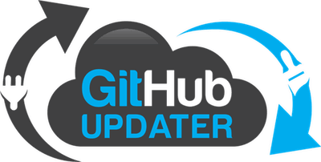
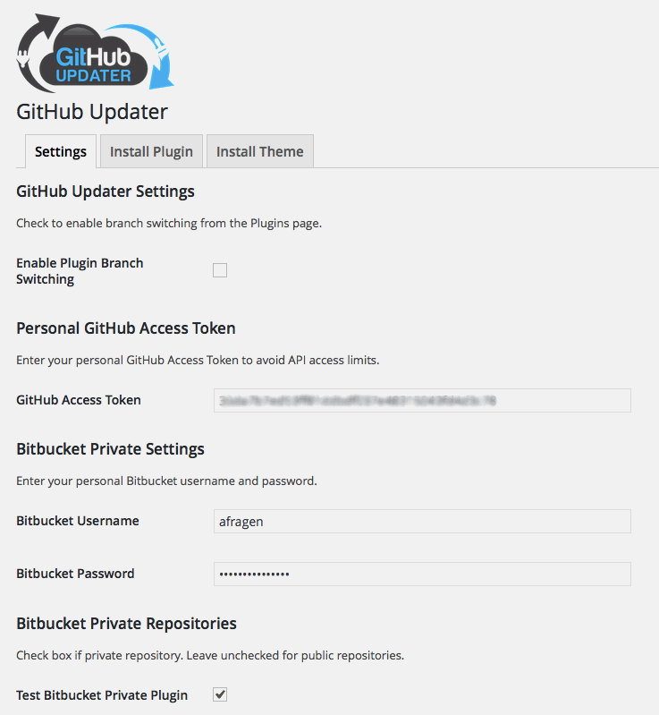
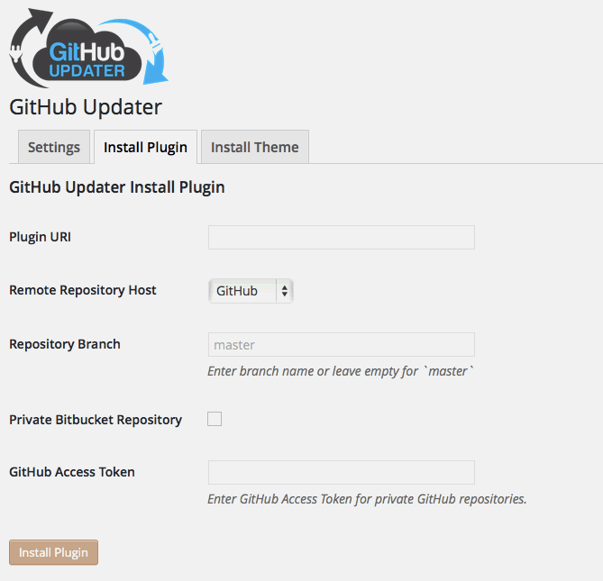

# GitHub Updater
* Contributors: [Andy Fragen](https://github.com/afragen), [Gary Jones](https://github.com/GaryJones), [Seth Carstens](https://github.com/scarstens), [contributors](https://github.com/afragen/github-updater/graphs/contributors)
* Tags: plugin, theme, update, updater, github, bitbucket, gitlab, remote install
* Requires at least: 3.8
* Requires PHP: 5.3
* Tested up to: 4.3 alpha
* Stable tag: master
* Donate link: http://bit.ly/github-updater
* License: GPLv2 or later
* License URI: http://www.gnu.org/licenses/gpl-2.0.html


A simple plugin to enable automatic updates to your GitHub, Bitbucket, or GitLab hosted WordPress plugins and themes. It also allows for the remote installation of plugins or themes.

This plugin is [not allowed in the wp.org repo](https://github.com/afragen/github-updater/issues/34). :frowning:

## Description

This plugin was designed to simply update any GitHub hosted WordPress plugin or theme. Your plugin or theme **must** contain a header in the style.css header or in the plugin's header denoting the location on GitHub. The format is as follows.

`GitHub Plugin URI: afragen/github-updater`  
`GitHub Plugin URI: https://github.com/afragen/github-updater`

or 

`GitHub Theme URI: afragen/test-child`  
`GitHub Theme URI: https://github.com/afragen/test-child`

...where the above URI leads to the __owner/repository__ of your theme or plugin. The URI may be in the format `https://github.com/<owner>/<repo>` or the short format `<owner>/<repo>`. You do not need both. Only one Plugin or Theme URI is required. You **must not** include any extensions like `.git`.

## Installation

### Composer

Run the composer command: ```composer require afragen/github-updater```


### Upload

1. Download the latest [tagged archive](https://github.com/afragen/github-updater/releases) (choose the "zip" option).
2. Go to the __Plugins -> Add New__ screen and click the __Upload__ tab.
3. Upload the zipped archive directly.
4. Go to the Plugins screen and click __Activate__.

### Manual

1. Download the latest [tagged archive](https://github.com/afragen/github-updater/releases) (choose the "zip" option).
2. Unzip the archive.
3. Copy the folder to your `/wp-content/plugins/` directory.
4. Go to the Plugins screen and click __Activate__.

Check out the Codex for more information about [installing plugins manually](http://codex.wordpress.org/Managing_Plugins#Manual_Plugin_Installation).

### Git

Using git, browse to your `/wp-content/plugins/` directory and clone this repository:

`git clone https://github.com/afragen/github-updater.git`

Then go to your Plugins screen and click __Activate__.

### Install GitHub Updater as a Must Use Plugin (optional)

1. Choose a method from above for installation.
1. **DO NOT** activate!
1. Symlink `wp-content/plugins/github-updater/mu/ghu-loader.php` in `wp-content/mu-plugins`.

#### in Linux
```
cd <WordPress root>
ln -sv wp-content/plugins/github-updater/mu/ghu-loader.php wp-content/mu-plugins
```

#### in Windows (Vista, 7, 8)
```
cd /D <WordPress root>
mklink wp-content\mu-plugins\ghu-loader.php wp-content\plugins\github-updater\mu\ghu-loader.php
```

This way you get automatic updates and cannot deactivate the plugin.

## Usage

### Plugins 

There must be a `GitHub Plugin URI`, `Bitbucket Plugin URI`, or `GitLab Plugin URI` declaration in the plugin's header.

~~~php
/*
Plugin Name:       GitHub Updater
Plugin URI:        https://github.com/afragen/github-updater
Description:       A plugin to automatically update GitHub hosted plugins and themes into WordPress. Plugin class based upon <a href="https://github.com/codepress/github-plugin-updater">codepress/github-plugin-updater</a>. Theme class based upon <a href="https://github.com/WordPress-Phoenix/whitelabel-framework">Whitelabel Framework</a> modifications.
Version:           1.0.0
Author:            Andy Fragen
License:           GNU General Public License v2
License URI:       http://www.gnu.org/licenses/gpl-2.0.html
Domain Path:       /languages
Text Domain:       github-updater
GitHub Plugin URI: https://github.com/afragen/github-updater
GitHub Branch:     master
*/
~~~

### Themes

There must be a `GitHub Theme URI`, `Bitbucket Theme URI`, or `GitLab Theme URI` declaration in the `style.css` file. When initially adding a theme, the directory **must** be identical to the repo name.

~~~css
/*
Theme Name:       Test
Theme URI:        http://drfragen.info/
Version:          0.1.0
Description:      Child theme of TwentyTwelve.
Author:           Andy Fragen
Template:         twentytwelve
Template Version: 1.0.0
GitHub Theme URI: https://github.com/afragen/test-child
GitHub Branch:    master
*/
~~~

### Optional Headers

`GitHub Branch`, `Bitbucket Branch`, and `GitLab Branch` are available but not required.

### Enterprise and Self-Hosted Support

#### GitHub Enterprise Support

Add the `GitHub Enterprise` header to the plugin or theme that is hosted on your GitHub self-hosted installation. The settings should be similar to `GitHub Enterprise: https://github.yourhost.com`.

#### GitLab CE/Enterprise Support

Add the `GitLab CE` or `GitLab Enterprise` header to the plugin or theme that is hosted on your GitLab self-hosted installation. The settings should be similar to `GitLab CE: https://gitlab.yourhost.com` or `GitLab Enterprise: https://gitlab.yourhost.com`.

### Versions

GitHub Updater reads the `Version` headers from both the local file and the remote file. For an update to show as available the remote version number **must** be greater than the local version number. It is **required** to have a `Version` header in your main plugin file or your theme's `style.css` file. It is better to use [Semantic Versioning](http://semver.org).

If you tag releases the version number of the tag must be the same as in the file inside of the tag. Otherwise a circle of updating may ensue. You do not have to tag releases; but if you do the tagged version will be downloaded preferentially. Please refer to the sections below on branches and tags.

When testing I find it simpler to decrease the version number in the local file rather than continually push updates with version number increments or new tags.

## Branch Support

To specify a branch that you would like to use for updating, just add a branch header.  If you develop on `master` and are pushing tags, GitHub Updater will update to the newest tag. If there are no tags or the specified branch is not `master` GitHub Updater will use the specified branch for updating.

The default state is either `GitHub Branch: master` or nothing at all. They are equivalent.

If you want to update against branch of your repository other than `master` and have that branch push updates out to users make sure you specify the testing branch in a header, i.e. `GitHub Branch: develop`. When you want users to update against the release branch just have them manually change the header to `GitHub Branch: master` or remove it completely. Tags will be ignored when a branch other than `master` is specified. In this case I would suggest semantic version numbering similar to the following, `<major>.<minor>.<patch>.<development>`.

In the GitHub Updater Settings there is a new setting to enable branch switching for plugins. When checked there will be a new ability from the Plugins page to switch between plugin branches. Switching to the current branch will reinstall the current branch.

## Tagging

If the branch header, i.e. `GitHub Branch` or `Bitbucket Branch`, is not specified (or is set to `master`), then the latest tag will be used. GitHub Updater will preferentially use a tag over a branch in this instance.

If you prefer to create a release asset for distribution, this will be used in preference to a tag.

## Bitbucket Support

Instead of the `GitHub Plugin URI` header you will need to use the `Bitbucket Plugin URI` header.

Instead of the `GitHub Theme URI` header you will need to use the `Bitbucket Theme URI` header.

The `Bitbucket Branch` header is supported for both plugins and themes.

## GitLab Support

Instead of the `GitHub Plugin URI` header you will need to use the `GitLab Plugin URI` header.

Instead of the `GitHub Theme URI` header you will need to use the `GitLab Theme URI` header.

The `GitLab Branch` header is supported for both plugins and themes.

You must set a GitLab private token. Go to your GitLab profile page under Edit Account. From here you can retrieve or reset your GitLab private token.

## Private Repositories

Public repositories will not show up in the Settings page.



### GitHub Private Repositories

In order to specify a private repository you will need to obtain a [personal access token](https://github.com/settings/tokens/new). Once you have this, simply add the token to the appropriate plugin or theme in the Settings tab.

Leave this empty if the plugin or theme is in a public repository.

### Bitbucket Private Repositories

Add your personal Bitbucket username and password in the Settings tab. In order to authenticate with the Bitbucket API you will need to have at least `read` privileges for the Bitbucket private repository.

In order to specify a private repository you will need to check the box next to the repository name in the Settings tab.

Leave this unchecked if the plugin or theme is in a public repository.

Do not include your username or password in the plugin or theme URI.

## WordPress and PHP Requirements

There are now two **optional** headers for setting minimum requirements for both WordPress and PHP.

Use `Requires WP:` to set the minimum required version of WordPress needed for your plugin or theme. eg. `Requires WP: 3.8`

Use `Requires PHP:` to set the minimum required version of PHP needed for your plugin or theme. eg. `Requires PHP: 5.3.0`

At the moment the default values are **WordPress 3.8.0** and **PHP 5.3.0**

## Deleting Transients

If you use the **Check Again** button in the WordPress Updates screen then all the transients will be deleted and the API will be queried again. This may cause timeout issues against the API, especially the GitHub API which only allows 60 unauthenticated calls per hour.

Be careful about refreshing the browser window after this as you may be continually deleting the transients and hitting the API. 

## Hosting Plugin in WP.org Repository

If you develop your plugin on GitHub and it also resides in the WP.org repo, the plugin will preferentially pull updates from WP.org if `GitHub Branch: master`. If `GitHub Branch` is anything other than `master` then the update will pull from GitHub. Make sure that the version of your plugin uploaded to WP.org has `GitHub Branch: master`.

The same applies for Bitbucket or GitLab hosted plugins.

## Remote Installation of Repositories

From the `GitHub Updater Settings Page` there is a tabbed interface for remote installation of plugins or themes. You may use either a full URI or short `<owner>/<repo>` format.



## Error Messages

GitHub Updater now reports a small error message on certain pages in the dashboard. The error codes are HTTP status codes. Most often the code will be either 403 or 401. If you don't have an Access Token set for a private GitHub repo you will get a 404 error.

### Personal GitHub Access Token

There is a new setting for a personal GitHub Access Token. I **strongly** encourage everyone to create a [personal access token](https://github.com/settings/tokens/new). Create one with at least `public_repo` access and your rate limit will be increased to 5000 API hits per hour. Unauthenticated calls to the GitHub API are limited to 60 API calls per hour and in certain circumstances, like shared hosting, these limits will be more frequently hit. Thanks [mlteal](https://github.com/mlteal).

### 403 - Unauthorized Access

#### GitHub
* usually this means that you have reached GitHub API's rate limit of 60 hits per hour. This is informative and should go away in less than an hour. See above regarding the setting of a personal access token to eliminate this entirely.
* a private GitHub repo without an Access Token designated in the Settings.
* will tell you how long until GitHub API's rate limit will be reset.

### 401 - Incorrect Authentication

#### Bitbucket
* incorrect Bitbucket user/pass, no `read` access to private Bitbucket repo
* private Bitbucket repo not checked in Settings

#### GitHub
* using an incorrect private repo GitHub Access Token for a public repo
* an incorrect Access Token for a private GitHub repo.

### 429 - Too Many Requests

I've seen this error code occasionally with Bitbucket.

## Extended Naming

There's a hidden preference to use extended naming for plugin directories. Extended Naming follows the convention `<git>-<owner>-<repo>`. The normal method is to name the plugin directory `<repo>`. Unfortunately there may be a _potential_ conflict with a WP.org plugin. This preference mitigates that potential conflict. If you switch between normal and extended naming you might have to reactivate your plugins.

To set Extended Naming add `define( 'GITHUB_UPDATER_EXTENDED_NAMING', true );` in your `wp-config.php` or your theme's `functions.php`.

## Extras

[szepeviktor](https://github.com/szepeviktor) has created an add-on plugin to GitHub Updater that identifies all plugins with an icon in the plugin view for GitHub or Bitbucket depending upon where they get updates. It's very clever.
<https://github.com/szepeviktor/github-link>

### Translations

* French by
    * [Daniel Ménard](https://github.com/daniel-menard)
    * [fxbenard](https://github.com/fxbenard)
* Italian by [Enea Overclokk](https://github.com/overclokk)
* Portuguese by
    * [Valerio Souza](https://github.com/valeriosouza)
    * [Pedro Mendonça](https://github.com/pedro-mendonca)
* Ukrainian by [Andrii Ryzhkv](https://github.com/andriiryzhkov)
* Swedish by [Andréas Lundgren](https://github.com/Adevade)
* Arabic by [Hyyan Abo FAkher](https://github.com/hyyan)
* Spanish by [Jose Miguel Bejarano](https://github.com/xDae)
* German by [Linus Metzler](https://github.com/limenet)
* Romanian by [Corneliu Cirlan](https://github.com/corneliucirlan)
* Japanese by [ishihara](https://github.com/1shiharat)
* Russian by [Anatoly Yumashev](https://github.com/yumashev)

## Issues

Please log issues on the GitHub at https://github.com/afragen/github-updater/issues

If you are using a WordPress Multisite installation, the plugin **should** be network activated.

When first downloading and installing a plugin from GitHub you might have to do the following, otherwise the next update may not be able to cleanup after itself and re-activate the updated plugin or theme. Or you can just use the remote install feature and this will be done for you. :wink:

1. Unzip the archive.
2. Fix the folder name to remove to extra stuff GitHub adds to the download, like _-master_.
3. Copy the folder to your plugins directory **or** re-zip folder and add from plugins page.

W3 Total Cache object cache also clears the transient cache. Unfortunately this hampers GitHub Updater's storage of API data using the Transient API. The solution is to turn off the object cache.

## ChangeLog

See [CHANGES.md](CHANGES.md). In your project create a `CHANGES.md` or `CHANGELOG.md` file.

## Credits

This plugin's theme updater class was based upon [Whitelabel Framework's updater-plugin.php](https://github.com/WordPress-Phoenix/whitelabel-framework/blob/master/inc/admin/updater-plugin.php), which was based upon https://github.com/UCF/Theme-Updater.

The plugin updater class was based upon [codepress/github-plugin-updater](https://github.com/codepress/github-plugin-updater).

Includes

* [Emanuil Rusev's](https://github.com/erusev) [Parsedown](https://github.com/erusev/parsedown) for rendering ChangeLogs.
* [Mark Jaquith's](https://github.com/markjaquith) [WordPress Plugin Readme Parser](https://github.com/markjaquith/WordPress-Plugin-Readme-Parser/tree/WordPress.org) for parsing `readme.txt`.

GitHub Updater logo by [LogoMajestic](http://www.logomajestic.com).

## Pull Requests

Please fork and submit pull requests against the `develop` branch.
